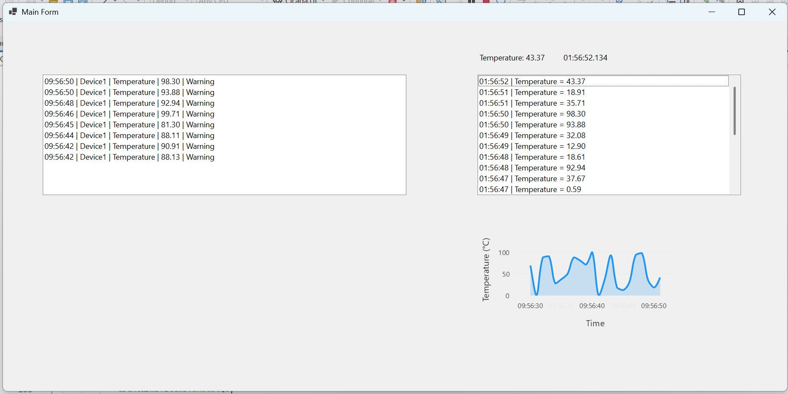

# 🚀 Cicada Industrial Device Monitoring System

> A lightweight industrial monitoring platform built with **.NET 9**, **WinForms**, and modern distributed architecture principles (SCADA/MES‑inspired).

---

## 📌 Overview

Cicada is a real-time industrial device monitoring system designed to simulate and scale toward real-world MES/SCADA environments.

It demonstrates:

- Real-time telemetry ingestion
- High-performance data pipeline
- Plugin-based extensibility
- UI + backend service decoupling
- Time-series data architecture
- Cloud-ready deployment design

---

## 🏗️ Architecture

```
               ┌───────────────┐
               │   WinForms UI  │
               └───────┬───────┘
                       │ SignalR
       ┌───────────────▼───────────────────────────────┐
       │            Worker Service (Core)              │
       │───────────────────────────────────────────────│
       │  • Telemetry Producer                         │
       │  • Channel (Data Bus)                         │
       │  • Pipeline Engine                            │
       │  • Plugin Engine                              │
       │  • Alarm Engine                               │
       └───────────────┬───────────────────────────────┘
                       │
       ┌───────────────▼───────────────────────────────┐
       │       Stream Layer (Redis / Kafka)            │
       └───────────────┬───────────────────────────────┘
                       │
       ┌───────────────▼───────────────────────────────┐
       │        Time-Series DB (InfluxDB)              │
       └───────────────┬───────────────────────────────┘
                       │
       ┌───────────────▼───────────────────────────────┐
       │         Cloud / AI Analysis Layer             │
       └───────────────────────────────────────────────┘
```

---

## 🧩 Key Features

### ⚡ Real-Time Data Pipeline
- Built with `System.Threading.Channels`
- Producer / Consumer pattern
- High-throughput, async-safe design

### 🔌 Plugin Architecture
- Runtime DLL loading (Reflection)
- Hot extensibility
- Decoupled business modules

### 📊 Live Monitoring UI
- WinForms + LiveCharts2
- Real-time chart updates
- Sliding window optimization

### 🚨 Alarm System
- Rule-based alert engine
- Multi-level alerts (Warning / Critical)
- UI integration

### 🏭 Multi-Device Support
- Config-driven device definitions
- Scalable device model

### 🔄 Service-Oriented Architecture
- Background Worker Service
- UI decoupled via SignalR

### ☁️ Cloud-Ready Design
- Docker support
- Kubernetes-ready architecture
- Stream processing ready (Kafka / Redis)

---

## 📁 Project Structure

```
Cicada/
├── Cicada.UI                # WinForms UI
├── Cicada.Service           # Background Worker Service
├── Cicada.Biz               # Application Services
├── Cicada.Domain            # Entities & Interfaces
├── Cicada.Infra             # Data Access (SQLite / TSDB)
├── Plugins/                 # External plugin modules
└── docker/                  # Deployment configs
```

---

## ⚙️ Technologies

- .NET 9
- WinForms
- LiveCharts2
- Serilog
- SQLite / InfluxDB
- SignalR
- MQTTnet
- Docker / Kubernetes (optional)
- Redis / Kafka (optional)

---

## 🚀 Getting Started

### 1️ Clone the repo

```bash
git clone https://github.com/yourname/cicada-monitoring.git
```

### 2️ Run Worker Service

```bash
cd Cicada.Service
dotnet run
```

### 3️ Run UI

```bash
cd Cicada.UI
dotnet run
```

### 4️ (Optional) Start InfluxDB

```bash
docker run -p 8086:8086 influxdb:latest
```

---

## 📺 Demo Features

- Real-time telemetry stream
- Live chart updates
- Alarm triggering (Temperature > threshold)
- Multi-device simulation

---

## 🧠 Design Highlights

### ✅ Decoupled Architecture
UI, data processing, and storage are completely independent.

### ✅ High Throughput Pipeline
Channel-based design avoids locking and improves performance.

### ✅ Extensibility First
New features can be added via plugins without modifying core system.

### ✅ Industrial Pattern Alignment
Inspired by real MES / SCADA system architecture.

---

## Screenshots


*Real-time machine status and telemetry* 

---

## 🔮 Future Improvements

- OPC UA real device integration
- Distributed deployment (K8s)
- Historical replay system
- Advanced anomaly detection (ML)
- Multi-tenant support

---

## 📄 License

MIT License

---

## 👨‍💻 Author

Kent Kong

---

## 💡 Notes

This project is designed for:

- Learning industrial system architecture
- Demonstrating advanced .NET engineering skills
- Preparing for senior-level backend / industrial software roles
```

---
